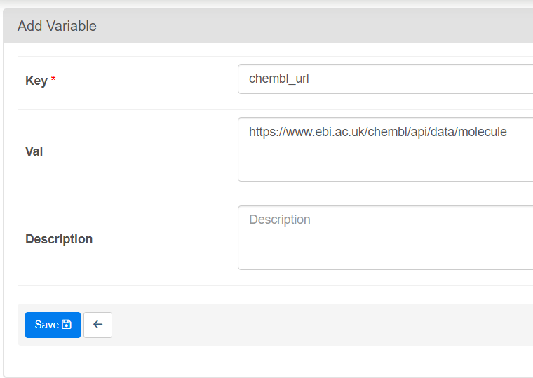
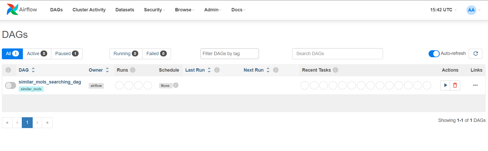
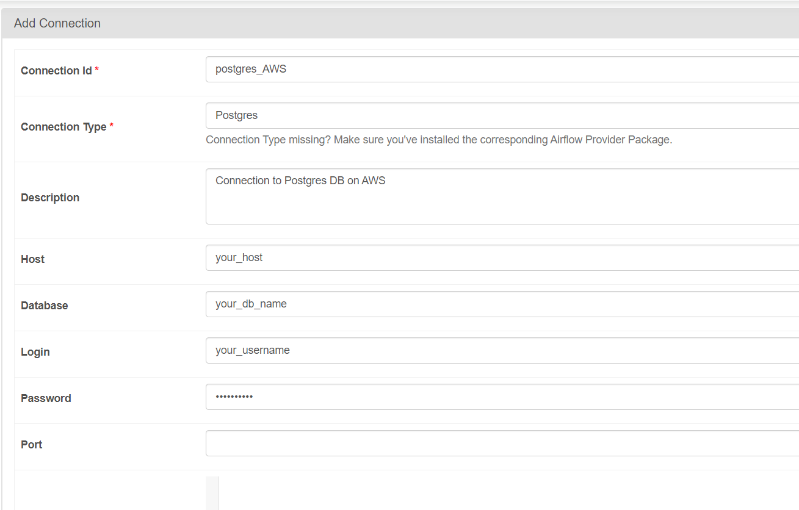
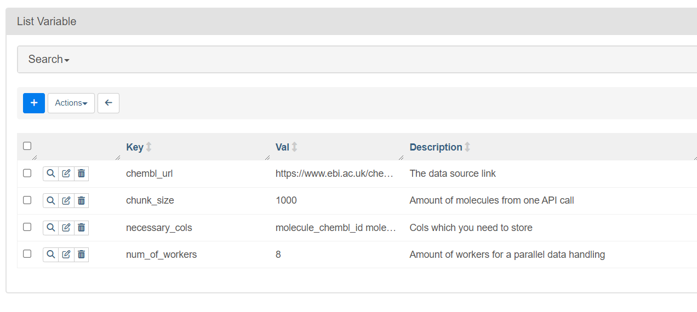
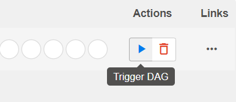
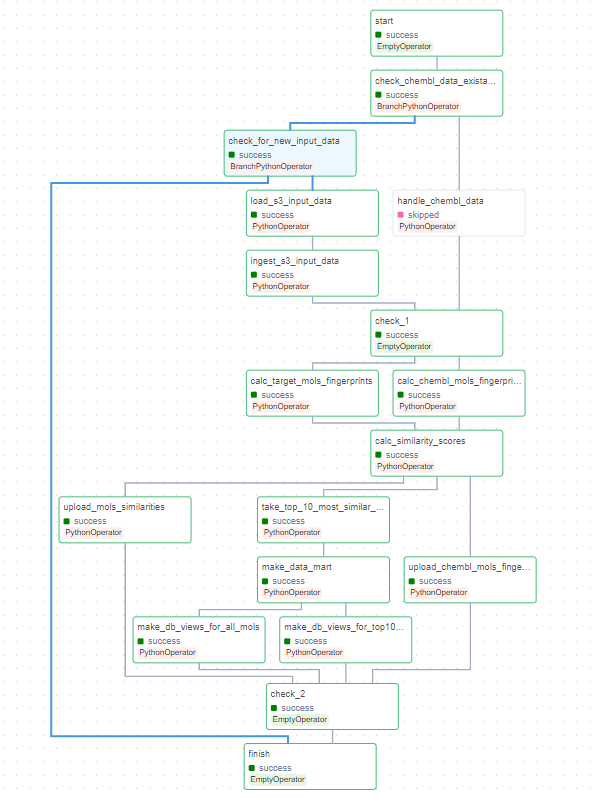

# QuantoriDEProject
## About 
This pipeline gets top-10 most similar molecules for input set of molecules. Where input set of molecules is taken from AWS S3 bucket. 

## Get started

#### 1) Docker
Make sure that you have docker on your machine. How to install it see [here](https://www.docker.com/get-started/).

#### 2) Clone repo
Open the terminal in the folder where you want to store the project and tipe the following command in the terminal:
```bash
git clone https://github.com/skomaroh1845/QuantoriDEProject.git
```

#### 3) Build the docker image and run the containers 
Run this command in the terminal:
```bash
docker-compose up --build
```
The terminal should be opened in the folder with docker-compose.yml and dockerfile.

#### 4) Open and log in the Airflow UI
Open a tab in your web browser at `http://localhost:8080/`. Login and password are `admin` by default. After logging you should see something similar to this:



#### 5) Setup the connection
In the above menu go to Admin->Connections, press add connection button and fill the fields with connection info for your DB.



#### 6) Setup variables
In the above menu go to Admin->Variables, you need to add `num_of_workers` variable for multiprocessing, `chembl_url` with the link to a data source, `necessary_cols` with the list of cols (sep=' ') which you want so save from original data - mine was `molecule_chembl_id molecule_properties molecule_structures molecule_type`, and `chunk_size` - how many molecules you want to get from one API call, ChEMBL API gets value <= 1000.



#### 7) Edit config `airflow.cfg`
This setting will cause airflow to start a new Python interpreter when running task instead of forking/using multiprocessing, and will allow us using multiprocessing inside the tasks. Set this variable `True` in `airflow.cfg` file.
```python
execute_tasks_new_python_interpreter = True
```
Also increase sql alchemy pool recycle time and number of connections.
```python
sql_alchemy_pool_recycle = 10000
sql_alchemy_pool_size = 10
```

#### --------------------------- Coming soon --------------------------- 

#### 7) Launch the DAG
Click the trigger DAG button on the right side and go drink coffee, now machines is working instead of you.




## Pipeline structure



