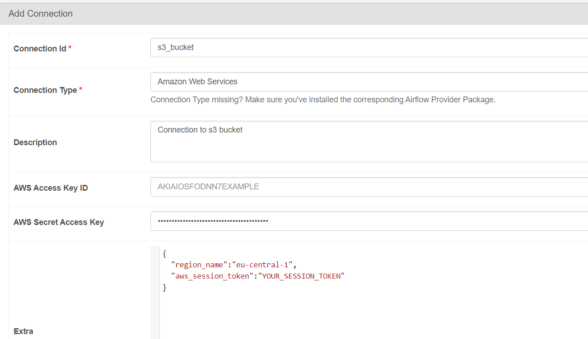

 


I managed to make a pipeline only up to the function for calculating the similarity of molecules, further operators are just empty functions, except one for selecting the top 10 molecules, it was written but not debugged. 

But I think it’s still not bad for 3 days of work) 

Perhaps I’ll finish the project in the next couple of days, if so, the finishing touches will be in the `after_deadline` branch.

For any questions about the solution ask me in telegram `@komarov_na`, I may accidentally miss messages in Teams.

P.S. As you understand, there was no time to write tests for this)


# QuantoriDEProject
## About 
This pipeline gets top-10 most similar molecules for input set of molecules. Where input set of molecules is taken from AWS S3 bucket. 

## Get started

#### 1) Docker
Make sure that you have docker on your machine. How to install it see [here](https://www.docker.com/get-started/).

#### 2) Clone repo
Open the terminal in the folder where you want to store the project and tipe the following command in the terminal:
```bash
git clone https://github.com/skomaroh1845/QuantoriDEProject.git
```

#### 3) Build the docker image and run the containers 
Run this command in the terminal:
```bash
docker-compose up --build
```
The terminal should be opened in the folder with docker-compose.yml and dockerfile.

#### 4) Open and log in the Airflow UI
Open a tab in your web browser at `http://localhost:8080/`. Login and password are `admin` by default. After logging you should see something similar to this:


#### 5) Set up connections
In the above menu go to Admin->Connections, press add connection button and fill the fields with connection info for your DB, **connection_id should be `postgres_AWS`**. 


Add a connection to AWS S3 bucket. **Connection_id should be `s3_bucket`**. Also provide json in Extra field with `region_name` and `aws_session_token`.




#### 6) Set up variables
In the above menu go to Admin->Variables, you need to add all following variables: 
- `num_of_workers` for multiprocessing (my value: `8`);
- `chembl_url` with the link to a data source (`https://www.ebi.ac.uk/chembl/api/data/molecule`);
- `necessary_cols` with the list of cols (sep=' ') which you want so save from original data (mine was: `molecule_chembl_id molecule_properties molecule_structures molecule_type`);
- `chunk_size` - how many molecules you want to get from one API call, ChEMBL API gets value <= 1000 (my value: `1000`);
- `bucket_name` name of bucket where you want to store results (my value: `de-school-2024-aws`);
- `input_prefix` prefix of input folder in s3 bucket with target molecules, should ends with "/" (my value: `final_task/input_files/`);
- `output_prefix` prefix of output folder in s3 bucket, should ends with "/" (my value: `final_task/komarov_nikolai/`);


#### 7) Edit config `airflow.cfg`
This setting will cause airflow to start a new Python interpreter when running task instead of forking/using multiprocessing, and will allow us using multiprocessing inside the tasks. Set this variable `True` in `airflow.cfg`.
```python
execute_tasks_new_python_interpreter = True
```
Also increase sql alchemy pool recycle time and number of connections.
```python
sql_alchemy_pool_recycle = 10000
sql_alchemy_pool_size = 10
```


#### 7) Launch the DAG
Go to home page and click the trigger DAG button on the right side.
Сongratulations! You can go drink coffee, now machines is working instead of you.


## Pipeline structure

